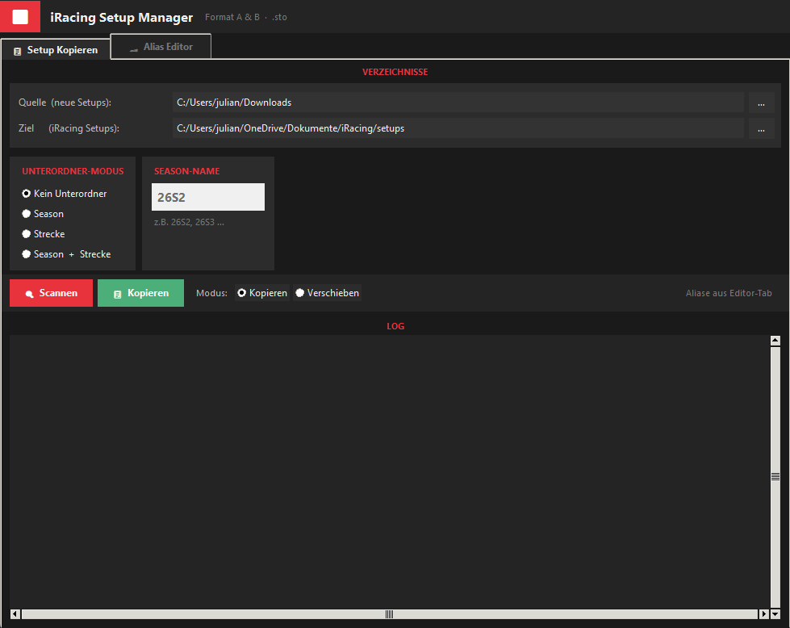
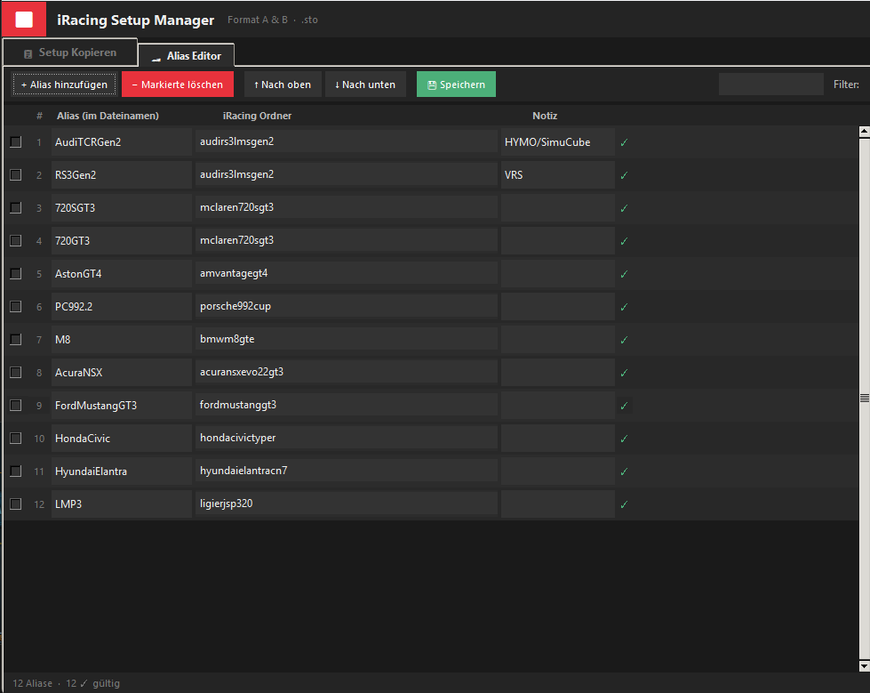

# iRacing Setup Manager

Ein leichter GUI-Werkzeugkasten für iRacing-Setup-Dateien (`.sto`).

## Screenshots

### Setup Kopieren Tab (Hauptansicht)


### Alias Editor Tab


## Funktionen

- Verwaltung von Alias-zu-iRacing-Ordner-Zuordnungen
- Automatische Erkennung von Setup-Dateinamen (Format A / Format B)
- Copy/Move von `.sto` Dateien von einem Quellordner in iRacing-Setup-Ordner
- Unterordner-Modus: `none`, `season`, `track`, `both`
- Persistente Konfiguration (`~/.iracing_setup_manager.json`) und Alias-Speicherung (`~/.iracing_aliases.json`)
- Intensives Scan-Logging in der GUI

## Formate

Akzeptiert:
- Format A (5 Teile): `Anbieter_Strecke_Season_Fahrzeug_Setuptyp`
- Format B (6+ Teile): `Anbieter_Season_Fahrzeug_Strecke_Sessiontyp_Setupstil`

## Installation

1. Python 3.11+ installieren.
2. Optional: Abhängigkeiten installieren:

```bash
pip install -r requirements.txt
```

3. Das Skript starten:

```bash
python iracing_setup_manager.py
```

4. Optional: Erstellen einer Einzeldatei-App mit PyInstaller:

```bash
pyinstaller --onefile --windowed --name "iRacing Setup Manager" iracing_setup_manager.py
```

## Bedienung

**Hauptscreen - Setup Kopieren Tab:**
1. App starten (z. B. `python iracing_setup_manager.py`).
2. Auf dem Tab `📋 Setup Kopieren`:
   - `Quelle  (neue Setups)` auswählen: Ordner mit neuen `.sto` Dateien.
   - `Ziel  (iRacing Setups)` auswählen: oberster iRacing-Setupordner (z. B. `Documents\iRacing\setups`).
3. Optional: `Unterordner-Modus` wählen:
   - `none` → keine zusätzliche Unterstruktur (nur Fahrzeugordner)
   - `season` → zusätzlich `Season`, z. B. `26S2`
   - `track` → zusätzlich `Strecke`
   - `both` → `Season` + `Strecke`
4. `Season-Name` im Feld eingeben (nur wenn `season` oder `both` gewählt).
5. `Scan` drücken:
   - Analyse aller `.sto` Dateien im Quellordner.
   - Zeigt für jede Datei Format, Auto-Alias, Track, Season und Zielpfad.
   - Warnungen für unbekannte Formate / fehlende Aliase.
6. `Kopieren` oder `Verschieben` drücken:
   - `Kopieren` erzeugt Kopien, `Verschieben` verschiebt die Dateien.
   - Existierende Dateien werden ersetzt, sofern sie denselben Namen haben.

**Alias Editor Tab:**
7. Im Tab `🏎 Alias Editor`:
   - Aliase anlegen: `Alias` (Text im Dateinamen) und `iRacing Ordner` (Zielordner in iRacing).
   - `Notiz` hinzufügen (optional).
   - `Direkt gültig` zeigt ❗ alle iRacing-Ordner, die bekannt sind.
   - Sortierung / Filterung / Löschen / Speichern möglich.

8. App beenden: Änderungen im Alias-Editor werden vor dem Schließen gespeichert oder abgefragt.

## Benutzung

1. Unter `Setup Kopieren` Quell- und Zielordner auswählen.
2. Alias-Editor prüfen und bei Bedarf Alias-Zuordnungen ergänzen.
3. Unter `Unterordner-Modus` wählen:

- `none`: Copy in `Ziel/<iRacing-Fahrzeug>`
- `season`: Copy in `Ziel/<Fahrzeug>/<Season>`
- `track`: Copy in `Ziel/<Fahrzeug>/<Track>`
- `both`: Copy in `Ziel/<Fahrzeug>/<Season>/<Track>`

4. `Scan` zum Überprüfen, dann `Kopieren` oder `Verschieben`.

## Alias Editor

- Hinzufügen, Entfernen, Sortieren, Filtern
- Autocomplete für iRacing-Ordner
- Validitätsanzeige (grün / gelb)

## Konfiguration

- `~/.iracing_setup_manager.json`: letzte Quelle, Ziel, Modus, Season, Move-Status
- `~/.iracing_aliases.json`: Alias-Liste

## Lizenz

MIT (oder eigene Nutzung frei).
